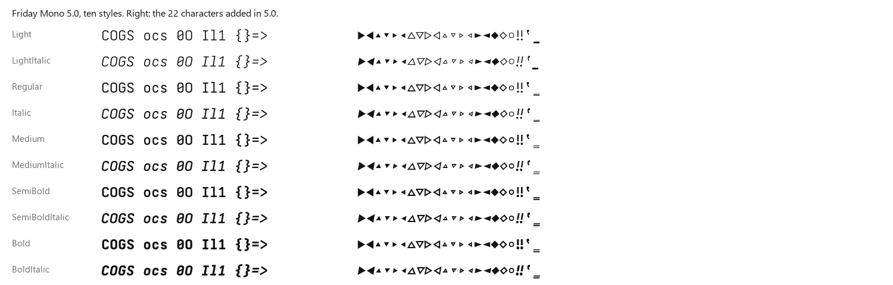
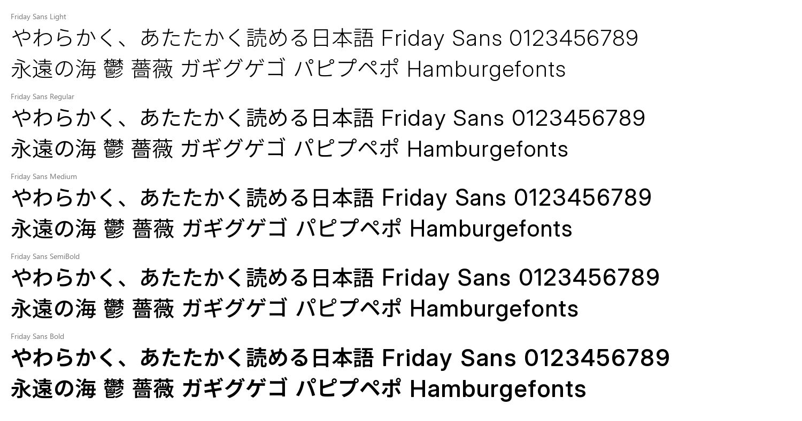

# Friday Fonts

日本語を書くための、2つの書体です。

- **Friday Mono**：コードを書くための等幅書体（欧文）
- **Friday Sans**：日本語の本文と画面の文字に使う書体

どちらも5つの太さ（Light / Regular / Medium / SemiBold / Bold）があり、SIL Open Font License 1.1で無料で使えます。

Friday Monoの日本語版（Friday Mono JP / Friday Mono Plain JP）は、4.93で配布を終えました。




## ダウンロード

| 書体 | 版 | ダウンロード |
|---|---|---|
| Friday Mono | 5.0.3 | [FridayMono-5.0.3.zip](https://github.com/Crowlxy/FridayFonts/releases/tag/mono-v5.0.3) |
| Friday Sans / Friday Sans UI | 3.002 | [FridaySans-3.002.zip](https://github.com/Crowlxy/FridayFonts/releases/tag/sans-v3.002) |

ZIPの中は次のとおりです。

| フォルダ・ファイル | 中身 |
|---|---|
| `ttf/` | パソコンにインストールするフォント |
| `web/` | Webサイト用のWOFF2とCSS |
| `README.md` | その版の変更点・検査結果 |
| `licenses/` | ライセンス |
| `SHA256SUMS.txt` | ファイルが壊れていないか確かめるためのハッシュ値 |

旧版は[Releases](https://github.com/Crowlxy/FridayFonts/releases)に残しています。日本語版のFriday Mono JP / Plain JPは[4.93](https://github.com/Crowlxy/FridayFonts/releases/tag/mono-v4.93)が最後の版です。

## どれを使えばいい？

| 使いたい場所 | 選ぶ書体 |
|---|---|
| エディタ・ターミナル | **Friday Mono**（日本語はアプリの代替フォントで表示） |
| 文書・Webページ・スライドの本文 | **Friday Sans** |
| アプリのボタン・メニューなど、画面の小さな文字 | **Friday Sans UI** |

Friday Monoの英数字は600 units（0.6em）の等幅です。ゼロの斜線は、OpenTypeの`ss01`または`cv01`で消せます。

コーディング用の合字（`->` `=>` `!=` `>=` `|>` など27種）は、5.1.0の**候補**で`ss02`として入っています（標準はオフ。公開前。[releases/mono-5.1.0/](releases/mono-5.1.0/README.md)）。

Sans UIは、Sansとほぼ同じ字面（実測で約1%小さい）で、かなや句読点の間隔を詰めた、画面の小さな文字向けの版です。

## インストール

使う書体のファイルを `ttf/` からインストールします。全部入れても問題ありません。

### Windows

1. ZIPを右クリックして「すべて展開」を選ぶ
2. `ttf` フォルダを開き、使う `.ttf` を全部選ぶ
3. 右クリックして「すべてのユーザーに対してインストール」を選ぶ（「インストール」でも可）
4. 使うアプリを一度終了して、もう一度開く

古い版が入っている場合は、上書きを求められたら「はい」を選んでください。

### macOS

1. ZIPをダブルクリックして展開する
2. `ttf` フォルダの `.ttf` を全部選び、ダブルクリックする
3. Font Bookで「インストール」を押す

### Linux

```sh
mkdir -p ~/.local/share/fonts/FridayFonts
cp ttf/*.ttf ~/.local/share/fonts/FridayFonts/
fc-cache -f
```

### アプリでの指定

**VS Code**（settings.json）

```json
"editor.fontFamily": "'Friday Mono', monospace",
"terminal.integrated.fontFamily": "'Friday Mono'",
"editor.fontLigatures": "'ss01'"   // ゼロの斜線を消す場合だけ
```

**Windows Terminal**（設定 → プロファイル → 外観 → フォント フェイス）：`Friday Mono`

**Web**（各ZIPの `web/` の中身をサイトに置いた場合）

```html
<link rel="stylesheet" href="friday-sans.css">
<link rel="stylesheet" href="friday-mono.css">
<style>
  body { font-family: "Friday Sans", sans-serif; }
  code, pre { font-family: "Friday Mono", monospace; }
</style>
```

太さは `font-weight` の300 / 400 / 500 / 600 / 700で選べます。

### うまく表示されないとき

- **太さを選べない（古いWindowsアプリ）**：Light・Medium・SemiBoldは「Friday Sans Light」のように、太さの付いた別の名前で並びます。古いアプリには4種類（Regular / Italic / Bold / Bold Italic）しか扱えないものがあるためです。
- **行間が広く感じる（Friday Mono）**：Windows Terminalで二重下線が一重に見える不具合を直すため、4.92から行の高さを1.28倍にしています。アプリ側の行間設定で調整できます。
- **0の斜線を消したい**：OpenTypeの`ss01`または`cv01`を有効にしてください。機能を指定できないターミナルでは切り替えられません。
- **IBM i ACS（5250）で文字が縦に潰れる**：Friday Monoの1.28倍の行の高さとACSの文字拡大縮小が合いません。ACSでは比較用の`Mono ACS Study`（行の高さ1.0倍、[comparisons/mono-acs-study](comparisons/mono-acs-study/README.md)）を使ってください。

## 書体の考え方

**読みやすさの基準は、実際の書体から測った数値で決める。** 欧文はSF Mono・SF Pro、和文はヒラギノ角ゴを測りました。測ったのは、線の太さ、字の大きさ、全角と半角の比率、かなと漢字の太さの比などです。それらの数値だけを使い、字形は自由に使える書体（OFL）の上で作り直しています。参照した書体の輪郭やデータは、一切含めていません。

**日本語と英数字の太さを揃える。** 漢字・かな・英字の線の太さを、全5段階で測りながら合わせています。混ぜて書いても、英字だけが濃い・かなだけが薄いということが起きないようにしています。

**ほかの等幅書体と並べて測る。** Friday Mono 5.0は、Cascadia Mono・Consolas・Geist Mono・Paper Mono・Fragment Mono・Roboto Monoと比べました。比べたのは、小さいサイズで丸い字と平らな字の高さがそろうか、行の中の文字の位置、罫線のつながり、収録文字です。劣っていた点を直しています。収録文字は、6書体中2書体以上が収録する文字を基準にしました。大文字・小文字の高さの比は、SF Monoに合わせています（キャップ高 / x-height = 1.333）。

**かなの一部は手で描いた。** 「と・さ・き・ふ・や」と、その濁音・小書き（ど・ざ・ぎ・ぶ・ぷ・ゃ）は、元の書体の形を使わず、手描きの線から作っています。全ウェイトで同じ骨格を太さだけ変えています。

**Windowsで崩れないことを確かめる。** Windowsは小さな文字を画面の画素に合わせて描くため、ヒント（字形の補正命令）次第で文字が崩れます。Friday Sans 2.5までは、漢字に専用のヒント（Chlorophytum）を付けていました。3.0ではヒントをすべて外し、輪郭を丸めて少し太らせています。Windows実機（WPF・WinUI・Edge・GDI）で比べ、見つかった問題を直しています。

## 作り方

| 部分 | 元にした書体 | ライセンス |
|---|---|---|
| Monoの英数字 | Iosevka（カスタムビルド） | OFL 1.1 |
| Mono 4.93までの漢字・かな | Noto Sans CJK JP | OFL 1.1 |
| Sansの英数字 | Inter 4.1 | OFL 1.1 |
| Sansの漢字・かな | Noto Sans CJK JP | OFL 1.1 |
| 手描きかな | このプロジェクトで作成 | OFL 1.1 |

ビルドの流れは次のとおりです。

1. 各ウェイトの目標の太さと大きさを、測った数値から決める
2. 元の書体から、その太さに合う位置の字形を取り出す。Noto・Interは可変フォントの軸、Iosevkaはウェイトごとの静的フォントを使う
3. 全角と半角の枠に揃え、横線の太さとかなの配置を整える
4. 欧文にttfautohint、漢字にChlorophytumでヒントを付ける（Sans 2.5まで。Sans 3.0はヒントを外しています）
5. Windows向けの修正（行の高さ、縦書きかな、記号、囲み文字）を入れる
6. 全グリフを描画して、エラー・欠け・太さの順番を検査する

Friday Mono 5.0は、4.93の配布フォントを入力にして、`scripts/mono50/`で次の処理を行いました。

- 輪郭の修正
- ヒントの付け直し
- 行の数値・罫線の調整
- 収録文字の見直し

詳しい手順と再ビルドの方法は[docs/BUILDING.md](docs/BUILDING.md)、設計の記録は[docs/DESIGN.md](docs/DESIGN.md)にあります。

## フォルダ構成

| フォルダ | 中身 |
|---|---|
| `releases/mono-5.0.3/`・`releases/sans-3.0/`（Sans 3.002）・`releases/sans-2.5/` | 現行版の説明・検査記録・見本（フォント本体はReleasesのZIP） |
| `releases/mono-5.1.0/` | Mono 5.1.0（コーディング合字 `ss02` を足した**候補**）の記録。承認前・公開前 |
| `releases/mono-5.0.1/`・`releases/mono-5.0.2/` | Mono 5.0.1 と、5.0.2（Light の ½ の修正。公開せず 5.0.3 に含めた）の記録 |
| `scripts/qa/` | ブラウザ（Chromium・Firefox・WebKit）での読み込み、HarfBuzz の組版の回帰、FontForge の検査（`docs/FONT-TOOLS.md` のツールを使う） |
| `reviews/` | 品質レビューの記録 |
| `releases/mono-4.93/` | 日本語版の最後の版（Mono JP / Plain JP）の記録 |
| `releases/archive/` | 旧版と試作版の説明・検査記録 |
| `scripts/` | フォントを作るためのスクリプト・手描きデータ・ヒント設定 |
| `docs/` | 設計の記録、ビルド手順、過去のリリースノート |

## 既知の制限

- Light・SemiBoldは、Windows実機での表示確認をまだ行っていません（Regular・Medium・Boldは確認済み）。Friday Mono 5.0.1はGDIでの描画検査のみで、アプリでの目視確認はこれからです。
- **Friday Sans / Sans UI の Light の壊れた漢字（共・題の画の欠け、武・昆・廃などの黒い楔）は、3.002 で直しました**（95字を作り直し）。3.002 は GitHub の [`sans-v3.002`](https://github.com/Crowlxy/FridayFonts/releases/tag/sans-v3.002) で公開しました。旧版 3.0（`sans-v3.0`、内部版 3.000）の Light には壊れが残っているので、3.002 を使ってください。[3.002 の記録](releases/sans-3.0/README.md)、[レビューの記録](reviews/2026-10-09-r3.md)、未解決の一覧は[レビュー結果.md](レビュー結果.md)
- Friday Mono 5.0.3のLight・LightItalicは、5.0.1より線を太くしました（62 → 66 units）。13〜24 pxのWindows・Macの実機で、Regularと並べた見え方はまだ確認していません。細い／太いと感じたら知らせてください。5.0.1のLightにあった½（U+00BD）の分母の壊れも、5.0.3で直っています（[releases/mono-5.0.3/](releases/mono-5.0.3/README.md)）。
- Friday Mono 5.1.0（候補）の合字は、Windows Terminal・VS Code・Macの実機での確認がまだです。`ss02`を指定できないアプリでは出ません。波線（`~`）を使うもの、`::` `:=` `..` などは未対応です（[releases/mono-5.1.0/](releases/mono-5.1.0/README.md)）。
- Friday Sansの日本語の約物詰め（palt / halt）は未対応です。
- 収録していない人名・地名用の漢字などは、アプリの代替フォントで表示されます。

## ライセンス

フォントはSIL Open Font License 1.1です。商用・非商用を問わず無料で使え、アプリや文書への埋め込みもできます。フォント単体の販売はできません。改変版を配布するときは「Friday」以外の名前にしてください。

- Friday Monoのライセンス：[scripts/OFL.txt](scripts/OFL.txt)
- Friday Sansのライセンス：[scripts/sans/OFL.txt](scripts/sans/OFL.txt)
- 元にした書体のライセンス：各ZIPの`licenses/`

詳しくは[LICENSE.md](LICENSE.md)を見てください。
