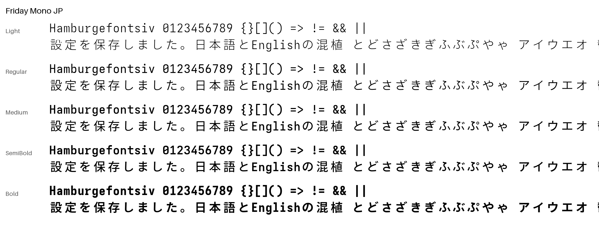
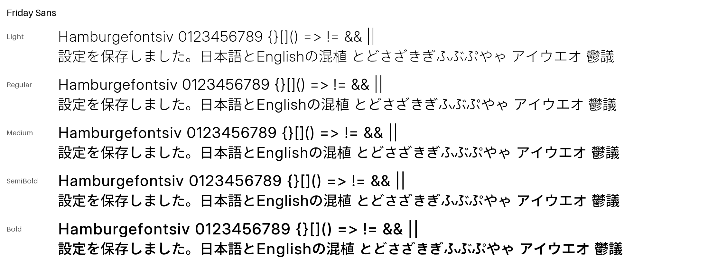

# Friday Fonts

日本語を書くための、2つの書体です。

- **Friday Mono**：コードを書くための等幅書体
- **Friday Sans**：日本語の本文と画面の文字に使う書体

どちらも5つの太さ（Light / Regular / Medium / SemiBold / Bold）があり、SIL Open Font License 1.1で無料で使えます。




## ダウンロード

| 書体 | 版 | ダウンロード |
|---|---|---|
| Friday Mono / Friday Mono JP / Friday Mono Plain JP | 4.93 | [FridayMono-4.93.zip](https://github.com/Crowlxy/FridayFonts/releases/tag/mono-v4.93) |
| Friday Sans / Friday Sans UI | 2.5 | [FridaySans-2.5.zip](https://github.com/Crowlxy/FridayFonts/releases/tag/sans-v2.5) |

ZIPの中は次のとおりです。

| フォルダ・ファイル | 中身 |
|---|---|
| `ttf/` | パソコンにインストールするフォント |
| `web/` | Webサイト用のWOFF2とCSS |
| `README.md` | その版の変更点・検査結果 |
| `licenses/` | ライセンス |
| `SHA256SUMS.txt` | ファイルが壊れていないか確かめるためのハッシュ値 |

旧版は[Releases](https://github.com/Crowlxy/FridayFonts/releases)に残しています。

## どれを使えばいい？

| 使いたい場所 | 選ぶ書体 |
|---|---|
| エディタ・ターミナルで、日本語も同じ書体で表示したい | **Friday Mono JP** |
| 同上で、ゼロ（0）に斜線が要らない | **Friday Mono Plain JP** |
| 英数字だけで十分。日本語は別の書体に任せたい | **Friday Mono**（日本語なし、軽い） |
| 文書・Webページ・スライドの本文 | **Friday Sans** |
| アプリのボタン・メニューなど、画面の小さな文字 | **Friday Sans UI** |

Friday Monoの英数字は半角（全角の半分の幅）です。Mono JPでは全角2：半角1の比率がそろうので、日本語の表や桁がずれません。

Sans UIは、Sansより字面を約5%小さくし、かなや句読点の間隔を詰めた、画面の小さな文字向けの版です。

## インストール

使う書体のファイルを `ttf/` からインストールします。全部入れても問題ありません。

### Windows

1. ZIPを右クリックして「すべて展開」を選ぶ
2. `ttf` フォルダを開き、使う `.ttf` を全部選ぶ
3. 右クリックして「すべてのユーザーに対してインストール」を選ぶ（「インストール」でも可）
4. 使うアプリを一度終了して、もう一度開く

古い版が入っている場合は、上書きを求められたら「はい」を選んでください。

### macOS

1. ZIPをダブルクリックして展開する
2. `ttf` フォルダの `.ttf` を全部選び、ダブルクリックする
3. Font Bookで「インストール」を押す

### Linux

```sh
mkdir -p ~/.local/share/fonts/FridayFonts
cp ttf/*.ttf ~/.local/share/fonts/FridayFonts/
fc-cache -f
```

### アプリでの指定

**VS Code**（settings.json）

```json
"editor.fontFamily": "'Friday Mono JP', monospace",
"terminal.integrated.fontFamily": "'Friday Mono JP'"
```

**Windows Terminal**（設定 → プロファイル → 外観 → フォント フェイス）：`Friday Mono JP`

**Web**（各ZIPの `web/` の中身をサイトに置いた場合）

```html
<link rel="stylesheet" href="friday-sans.css">
<link rel="stylesheet" href="friday-mono.css">
<style>
  body { font-family: "Friday Sans", sans-serif; }
  code, pre { font-family: "Friday Mono JP", monospace; }
</style>
```

太さは `font-weight` の300 / 400 / 500 / 600 / 700で選べます。

### うまく表示されないとき

- **太さを選べない（古いWindowsアプリ）**：Light・Medium・SemiBoldは「Friday Sans Light」のように、太さの付いた別の名前で並びます。古いアプリには4種類（Regular / Italic / Bold / Bold Italic）しか扱えないものがあるためです。
- **行間が広く感じる（Friday Mono）**：Windows Terminalで二重下線が一重に見える不具合を直すため、4.92から行の高さを1.28倍にしています。アプリ側の行間設定で調整できます。
- **0の斜線を消したい**：Friday Mono Plain JPを使ってください。どちらの版でも、OpenTypeの`zero`・`ss01`・`cv01`機能で切り替えられます。

## 書体の考え方

**読みやすさの基準は、実際の書体から測った数値で決める。** 欧文はSF Mono・SF Pro、和文はヒラギノ角ゴを測りました。測ったのは、線の太さ、字の大きさ、全角と半角の比率、かなと漢字の太さの比などです。それらの数値だけを使い、字形は自由に使える書体（OFL）の上で作り直しています。参照した書体の輪郭やデータは、一切含めていません。

**日本語と英数字の太さを揃える。** 漢字・かな・英字の線の太さを、全5段階で測りながら合わせています。混ぜて書いても、英字だけが濃い・かなだけが薄いということが起きないようにしています。

**かなの一部は手で描いた。** 「と・さ・き・ふ・や」と、その濁音・小書き（ど・ざ・ぎ・ぶ・ぷ・ゃ）は、元の書体の形を使わず、手描きの線から作っています。全ウェイトで同じ骨格を太さだけ変えています。

**Windowsで崩れないことを確かめる。** Windowsは小さな文字を画面の画素に合わせて描くため、ヒント（字形の補正命令）次第で文字が崩れます。漢字には専用のヒント（Chlorophytum）を付け、変形が大きすぎる箇所には上限を設けました。Windows実機（WPF・WinUI・Edge・GDI）で比べ、見つかった問題を直しています。

## 作り方

| 部分 | 元にした書体 | ライセンス |
|---|---|---|
| Monoの英数字 | Iosevka（カスタムビルド） | OFL 1.1 |
| Sansの英数字 | Inter 4.1 | OFL 1.1 |
| 漢字・かな | Noto Sans CJK JP | OFL 1.1 |
| 手描きかな | このプロジェクトで作成 | OFL 1.1 |

ビルドの流れは次のとおりです。

1. 各ウェイトの目標の太さと大きさを、測った数値から決める
2. 元の書体から、その太さに合う位置の字形を取り出す。Noto・Interは可変フォントの軸、Iosevkaはウェイトごとの静的フォントを使う
3. 全角と半角の枠に揃え、横線の太さとかなの配置を整える
4. 欧文にttfautohint、漢字にChlorophytumでヒントを付ける
5. Windows向けの修正（行の高さ、縦書きかな、記号、囲み文字）を入れる
6. 全グリフを描画して、エラー・欠け・太さの順番を検査する

詳しい手順と再ビルドの方法は[docs/BUILDING.md](docs/BUILDING.md)、設計の記録は[docs/DESIGN.md](docs/DESIGN.md)にあります。

## フォルダ構成

| フォルダ | 中身 |
|---|---|
| `releases/mono-4.93/`・`releases/sans-2.5/` | 現行版の説明・検査記録・見本（フォント本体はReleasesのZIP） |
| `releases/archive/` | 旧版と試作版の説明・検査記録 |
| `scripts/` | フォントを作るためのスクリプト・手描きデータ・ヒント設定 |
| `docs/` | 設計の記録、ビルド手順、過去のリリースノート |

## 既知の制限

- Light・SemiBoldは、Windows実機での表示確認をまだ行っていません（Regular・Medium・Boldは確認済み）。
- 日本語の約物詰め（palt / halt）は未対応です。
- 収録していない人名・地名用の漢字などは、アプリの代替フォントで表示されます。

## ライセンス

フォントはSIL Open Font License 1.1です。商用・非商用を問わず無料で使え、アプリや文書への埋め込みもできます。フォント単体の販売はできません。改変版を配布するときは「Friday」以外の名前にしてください。

- Friday Monoのライセンス：[scripts/OFL.txt](scripts/OFL.txt)
- Friday Sansのライセンス：[scripts/sans/OFL.txt](scripts/sans/OFL.txt)
- 元にした書体のライセンス：各ZIPの`licenses/`

詳しくは[LICENSE.md](LICENSE.md)を見てください。
